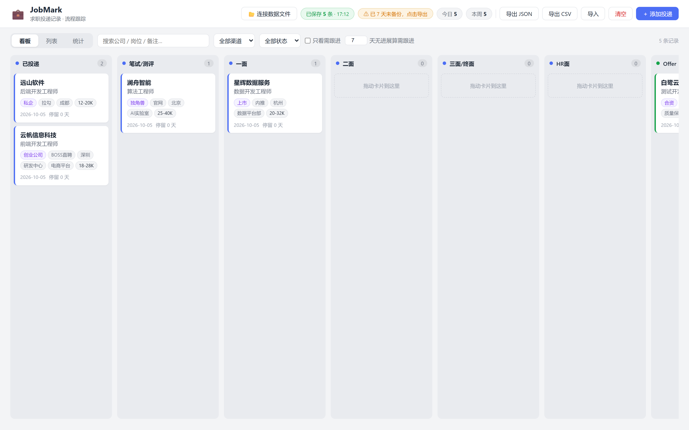

# JobMark · 求职投递记录

本地优先的求职投递记录与流程跟踪工具：看板式管理投递进展，数据 100% 保存在你自己的电脑上，不上传、无账号、无遥测。



## 功能

- **三种视图**：看板（按状态分列、拖拽流转）/ 列表（筛选、排序）/ 统计（投递趋势、环节漏斗、渠道效果）
- **状态流转**：已投递 → 笔试/测评 → 一面 → 二面 → 三面/终面 → HR面 → Offer / 流程结束，可查看完整流转历史
- **企业属性**：国企 / 央企 / 大厂 / 私企 / 上市 / 外企 / 合资 / 独角兽 / 创业公司（多选标签）
- **字段**：渠道、城市、分部、部门、薪资、JD 链接、面试链接、备注
- **跟进提醒**：N 天无进展自动标记（阈值可在工具栏调整），一键筛出
- **数据备份**：导出 / 导入 JSON 与 CSV

## 桌面版（Windows）

**[下载最新版 JobMark.exe](https://github.com/lilezi999111-gif/job-mark-app/releases/latest)**：免安装便携版，下载后双击运行。

- 数据实时写入程序同目录的 `jobmark-data.json`（原子写入），备份 = 复制这个文件
- 单实例运行，重复双击会聚焦已开窗口
- 首次运行如遇 SmartScreen 提示：点「更多信息」→「仍要运行」（未签名的个人程序，正常现象）

## 从源码运行

```bash
git clone https://github.com/lilezi999111-gif/job-mark-app.git
cd job-mark-app
npm install

npm run dev      # 开发模式（Vite 热更新，http://localhost:5173）

npm run build    # 构建单文件网页版 dist/index.html
npm start        # 启动 Electron 桌面版（加载 dist/index.html，改完前端需先 build）
```

也可以直接用浏览器打开 `dist/index.html`（数据存于浏览器 localStorage）。

## 构建发布

```bash
npm run build                            # 构建单文件网页版 dist/index.html
node scripts/build-seeded.mjs            # （可选）把初始数据封装进网页版，需要本地 seed.local.json
npx electron-builder --win portable      # 打包 Windows 便携 exe 到 release/
```

> 注：`npx electron-builder` 若报 `@noble/hashes` 的 ESM 错误，删除 `node_modules/app-builder-lib/node_modules/@noble` 后重试。

## 配置

验证脚本读取 `config.local.json`（不入库），模板见 `config.example.json`：

```json
{
  "chromePath": "C:\\Program Files\\Google\\Chrome\\Application\\chrome.exe",
  "appDir": "."
}
```

## 数据与隐私

- 所有数据保存在本地，不上传任何服务器
- 状态、投递日期、备注等全部存于数据文件；更换电脑 = 复制数据文件
- 个人数据文件（`jobmark-data.json`、`seed.local.json` 等）已在 `.gitignore` 中排除

## 自定义

- 状态流转、企业属性分类、渠道预设、跟进天数默认值：改 `src/constants.js`
- 改完 `npm run build` 重新构建即可

## License

[MIT](LICENSE)
